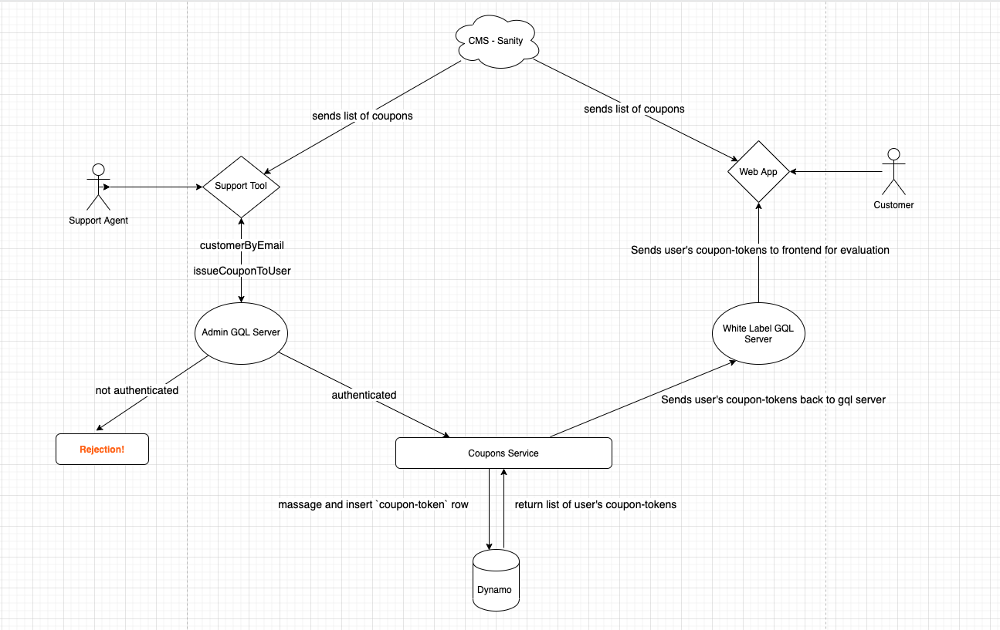

# Support Initiated Coupons

## Overview

**coupons** or **offers** are created in our CMS, Sanity. We create a list of all available coupons there, and tag the ones that a support agent should issue as a **Discount** type.

A support agent can then choose from a list of these discount **coupons** and issue them to a user.

When a support agent issues a **coupon** to a user, the support tool makes a graphql call to the admin apollo server -> `issueCouponToUser`
In addition to the **coupon**, the agent can select a quantity, reason, and add comments when necessary.

The Graphql layer will validate the support agent's authentication token then call our Coupon API.

The Coupon API will massage the data and insert a `coupon-token` record in our dynamodb table.

The newly created `coupon-token` will contain the sanity identifier for this **coupon**, and the user cognito id.

`coupon-tokens` are our way of storing how many of each **coupon** a user has

When a customer visits the web app, we request all the **coupons** from sanity, then evaluate which `coupon-tokens` have been assigned to the user.

After evaluation, if the user has any **coupons**, it should appear in the "Offers" tab of the web application.

## Flow Chart [(Click to see enlarged img)](https://github.com/rbilabs/support-coupon-summary/blob/master/flow-chart.png)



## Admin GQL Endpoint

- https://prod-brand-admin.rbictg.com/graphql
  - brand can be either `bk` | `plk` | `th`

## Authentication Header

```
{
  Authorization: 'Bearer $token'
}
```

- The \$token is a jwt encoded string provided by our AWS Cognito Service. It is generated after authenticating a support user's email/password combination
- In order to generate a token, the support agent must be a user in our aws admin pool

## Key queries / mutations

### Validating the existence of a user

```
customerByEmail(email: String!)
```

#### Sample Output (omitted properties that were not relevant. Can go into details about the coupon list / order list shapes if need be)

```
{
  customerByEmail: {
    details: {
      createdAt: String,
      couponRedemptions: [...],
      couponTokens: [...],
      creditCards: [...],
      customerId: String
      dob: String
      email: String
      isoCountryCode: String
      name: String
      orders: [...],
      phoneNumber: String,
      zipCode: String
    }
  }
}
```

### Issuing a coupon

```
issueCouponToUser(
  """
  Brief description on the situation that caused coupon to be issued
  This is optional.
  """
  comments: String

  """
  The identity of the coupon to redeem.
  This is required.
  """
  couponId: ID!

  """
  How many coupons to create
  """
  count: Int

  """
  The ISO-formatted timestamp of when the coupon token expires.
  If the value is null, then the coupon token never expires.
  This is optional.
  """
  expiresOn: String

  """
  Reason for issuing the coupon
  This is optional
  """
  reason: String

  """
  The identity of the user the coupon token is being assigned to.
  This is required
  """
  userId: ID!
): IssueCouponToUserResponse! @isAuthenticated
```

- `couponId` is the `_id` property on our sanity coupon
- `userId` is the `customerId` property returned from the `customerByEmail` query

#### Sample Output

```
{
  issueCouponToUser: {
    count: Int!
    tokens: [...]
  }
}

// shape of a coupon token
{
      """
      Brief description on the situation that caused coupon to be issued
      """
      comments: String

      """
      The coupon identity associated with the coupon token.
      """
      couponId: ID!

      """
      The ISO-formatted timestamp of when the coupon token was created.
      """
      createdAt: String!

      """
      The ISO-formatted timestamp of when the coupon token expires.
      If the value is null, then the coupon token never expires.
      """
      expiresOn: String

      """
      The partition key, which is equal to userId.
      """
      pk: String!

      """
      Reason for issuing the coupon
      """
      reason: String

      """
      The id of order that was refunded
      """
      refundedRbiOrderId: String

      """
      The id of the support agent who issue'd this coupon
      """
      supportCognitoId: String

      """
      The email of the support agent who issue'd this coupon
      """
      supportEmail: String

      """
      The identity of the coupon token.
      """
      tokenId: ID!

      """
      The identity of the user owning the coupon token.
      """
      userId: ID!
}
```
